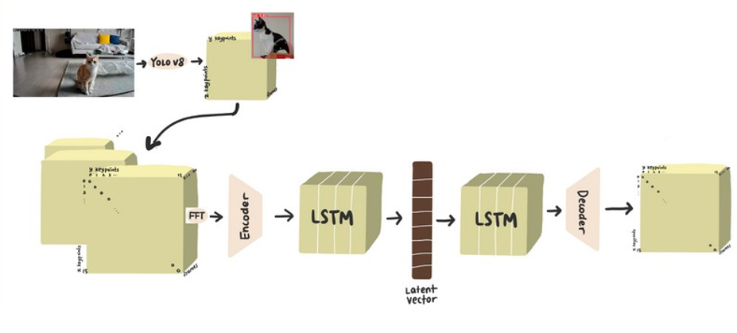

# Cat Anomaly Behavior Detection Project



## Overview
This project aims to detect abnormal behaviors in cats to monitor their health. The methodology involves using the Yolov8 model for keypoint estimation, followed by anomaly detection techniques to identify irregular behaviors.

## Project Objective
The primary goal of this research is to detect health abnormalities in cats by identifying unusual behaviors.

## Methodology
### Input Video
The process starts with a video of a cat.

### Keypoint Estimation
- **Yolov8 Model**: A pre-trained keypoint estimation model is used to extract keypoints representing various parts of the cat's body.

### Keypoint Distance Calculation
- **Distance Calculation**: Calculates the distances between keypoints to analyze spatial relationships.

### Normalization with FFT
- **FFT Normalization**: Applies Fast Fourier Transform (FFT) to the distances for normalization.

### Anomaly Detection
- **LSTM Autoencoder**: Utilizes an LSTM autoencoder to learn from normalized keypoint distances of normal behavior.
- **Detection**: Detects anomalies by comparing original and reconstructed distances.

## Framework
The project framework is outlined as follows:
- **Input**: Video of a cat.
- **Keypoint Estimation**: Uses Yolov8 for keypoint extraction.
- **Distance Calculation**: Computes differences between keypoints.
- **FFT Normalization**: Applies FFT to normalize differences.
- **LSTM Autoencoder**: Learns normal behavior patterns.
- **Anomaly Detection**: Identifies abnormal behaviors based on reconstructed distances.

## Repository Structure
- **data/**: Contains video files and related datasets.
- **models/**: Holds pre-trained models and their weights.
- **scripts/**: Scripts for preprocessing, keypoint estimation, distance calculation, FFT normalization, and anomaly detection.
- **notebooks/**: Jupyter notebooks for data analysis and model training.
- **results/**: Stores outputs and evaluation results.

## Installation
To set up the project locally, follow these steps:
```bash
git clone https://github.com/yourusername/cat-anomaly-behavior-detection.git
```

## Usage
1. **Preprocess the Video**: Convert video files using `scripts/preprocess_video.py`.
2. **Run Keypoint Estimation**: Extract keypoints with `scripts/keypoint_estimation.py`.
3. **Calculate Distances and Normalize**: Compute distances and apply FFT normalization using `scripts/calculate_distances.py`.
4. **Anomaly Detection**: Detect anomalies using the LSTM autoencoder with `scripts/anomaly_detection.py`.

## Contributing
Contributions are welcome! If you'd like to contribute, please follow these steps:
1. Fork the repository.
2. Create a new branch (`git checkout -b feature-branch`).
3. Make your changes (`git commit -am 'Add new feature'`).
4. Push to the branch (`git push origin feature-branch`).
5. Create a new Pull Request.

## License
This project is licensed under the MIT License. See the LICENSE file for details.

## Acknowledgements
- Special thanks to the developers of Yolov8 for providing an excellent keypoint estimation model.
- Thanks to all contributors for their efforts in improving this project.

For further information, please contact [sm32289@naver.com].
